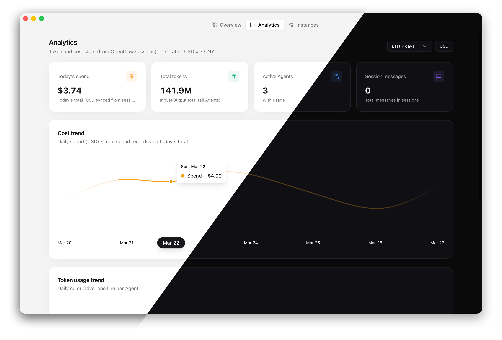
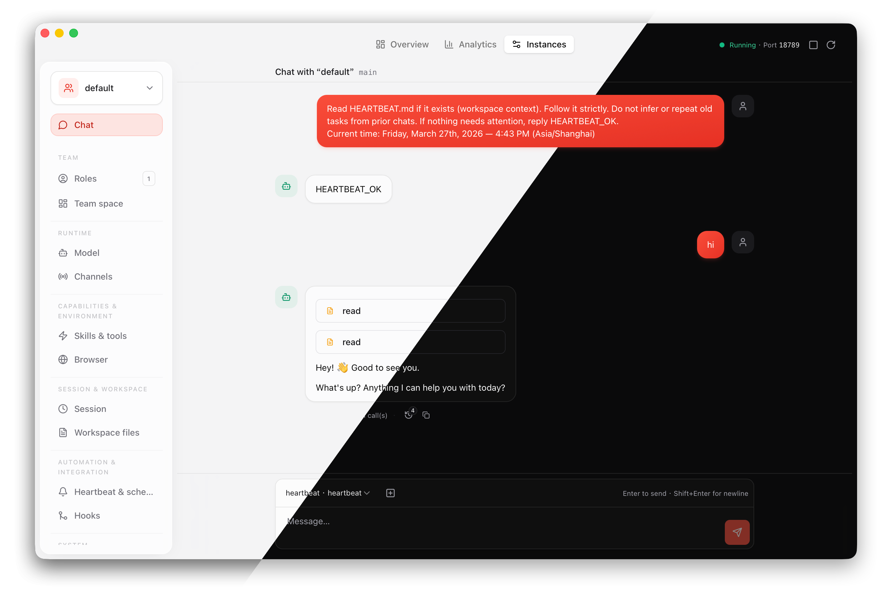

<div align="center">

# Pond

**Desktop Control Center for OpenClaw — Unified Operations, Team Collaboration & Multi-Instance Orchestration**

[](https://github.com/tageecc/pond/releases)
[](https://github.com/tageecc/pond/blob/main/LICENSE)
[](https://github.com/tageecc/pond/stargazers)

[](https://tauri.app/)
[](https://react.dev/)
[](https://www.typescriptlang.org/)
[](https://www.rust-lang.org/)

[Download](https://github.com/tageecc/pond/releases/latest) · [Quick Start](#quick-start) · [Features](#features)

English | **[简体中文](./README_zh.md)**

</div>

---

## Screenshots

<div align="center">
  
  <p><em>Real-time monitoring of token consumption, session states, and system resources</em></p>
</div>

<div align="center">
  
  <p><em>Streaming chat with tool execution timeline and reasoning visualization</em></p>
</div>

---

## Core Features

- 🚀 **One-Click Gateway Control** — Manage process lifecycle per instance, monitor ports, memory, and logs in real-time
- 🤝 **Team Collaboration Layer** — Role management, task orchestration (open → claimed → done/failed), real-time notifications & Leader coordination workflow
- 📊 **Real-Time Analytics** — Token usage, cost trends, session tracking, and system metrics visualization
- 🔄 **Multi-Instance Orchestration** — Multiple OpenClaw environments on a single machine (dev/test/prod), independent execution, config isolation
- ⚙️ **Visual Configuration** — Deep editing of `openclaw.json` (models, channels, skills, hooks), no manual JSON required
- 💬 **WebSocket Live Chat** — Streaming responses, tool call timeline, role-based routing, bidirectional sync with Gateway

---

## Quick Start

### Download Installers

Download from [GitHub Releases](https://github.com/tageecc/pond/releases/latest):

| Platform | File |
|----------|------|
| **macOS (Apple Silicon)** | `Pond_<version>_aarch64.dmg` |
| **macOS (Intel)** | `Pond_<version>_x64.dmg` |
| **Windows** | `Pond_<version>_x64.msi` |
| **Linux** | `Pond_<version>_amd64.AppImage` |

> [!TIP]
> **macOS users**: When opening unsigned apps for the first time, **Control-click** the app icon, select **Open** → **Open**. Or allow it in **System Settings → Privacy & Security**.

### Local Development

**Prerequisites**

- Node.js 20+
- [pnpm](https://pnpm.io)
- [Rust](https://rustup.rs/) (required for `pnpm tauri:dev`)

**Start Development Environment**

```bash
git clone https://github.com/tageecc/pond.git
cd pond
pnpm install
pnpm tauri:dev
```

> [!NOTE]
> If `pnpm install` fails, run `rm -rf node_modules/.cache && pnpm install`

**Build Production Installer**

```bash
pnpm build
pnpm tauri build
```

Artifacts will be in `src-tauri/target/release/bundle/`

---

## Features

<details>
<summary><strong>🎯 Team Collaboration</strong></summary>

<br/>

- **Role Management** — Auto-sync from `agents.list`, define Leader (`main`) and executor role responsibilities
- **Task State Machine** — `open` (unclaimed) → `claimed` (in progress) → `done` (completed) / `failed` (requires reason)
- **Real-Time Notifications** — Task changes pushed via WebSocket to relevant role sessions
- **Collaboration Skill** — Built-in `pond-team` skill defining complete workflow for Leader coordination, task breakdown, and executor closure
- **Team Space** — Metadata (`team/<instance>.json`) and tasks (`team/<instance>_tasks.json`), seamlessly integrated with OpenClaw native `read`/`write` tools

</details>

<details>
<summary><strong>🔧 Operations Management</strong></summary>

<br/>

- **Process Management** — Start/stop/restart Gateway per instance, monitor port, memory, CPU, and uptime
- **Log Aggregation** — Real-time Gateway log viewing and search, stderr error highlighting
- **Diagnostics Tools** — Health checks, channel probes, dependency detection (Rust, Node, OpenClaw versions)
- **Skill Management** — Install/uninstall/update skills, open skill directories, support Agent path installation

</details>

<details>
<summary><strong>📊 Data Analytics</strong></summary>

<br/>

- **Real-Time Metrics** — Token usage, cost, session count, active agents, system resources (CPU/RAM)
- **Historical Tracking** — Sync usage data from session records, filter by instance, role, time range
- **Trend Visualization** — Time series charts, cost rankings, anomaly detection
- **Export & Reports** — Support CSV export, generate cost reports

</details>

<details>
<summary><strong>⚙️ Configuration Orchestration</strong></summary>

<br/>

- **Visual Editing** — All `openclaw.json` fields (models, channels, skills, browser, session, workspace, heartbeat, hooks, logs)
- **Real-Time Validation** — Instant feedback on config changes, avoid JSON syntax errors
- **Multi-Instance Sync** — API Key pool sharing across instances, quick config template replication
- **Backup & Recovery** — Config history version management

</details>

<details>
<summary><strong>🔄 Multi-Instance Orchestration</strong></summary>

<br/>

- **Environment Isolation** — Multiple OpenClaw directories on one machine (`~/.openclaw`, `~/.openclaw-dev`, `~/.openclaw-prod`)
- **Independent Execution** — Each instance has its own Gateway process, port, config, and team data
- **Unified View** — Cross-instance monitoring, config comparison, resource statistics
- **Quick Switching** — Seamless switching between instances, maintaining their respective running states

</details>

<details>
<summary><strong>💬 Real-Time Chat</strong></summary>

<br/>

- **Streaming Response** — WebSocket bidirectional communication, typewriter effect rendering in real-time
- **Tool Execution Timeline** — Visualize tool call chains, execution duration, parameters, and return values
- **Reasoning Process** — Display model internal thinking (reasoning)
- **Role-Based Routing** — In multi-agent scenarios, chat can specify roles (based on `agents.list`)
- **Session Management** — Historical session search, export, deletion

</details>

---

## How It Works

```
  ┌─────────────┐     ┌──────────────┐     ┌─────────────────┐
  │  React UI   │────▶│ Tauri (Rust) │────▶│ OpenClaw Gateway │
  │  Zustand    │     │ invoke / WS  │     │  ~/.openclaw*    │
  └─────────────┘     └──────────────┘     └─────────────────┘
```

1. **Config Discovery** — Scan OpenClaw directory structure, load `openclaw.json` and team data
2. **Process Orchestration** — Rust backend manages Gateway subprocesses per instance, auto port allocation
3. **State Sync** — WebSocket real-time bidirectional communication for chat flow, tool execution, task changes
4. **Concurrency Safety** — Team metadata and task files use file locks (`fs4`) to ensure multi-process write safety
5. **Protocol Compatibility** — Fully compatible with OpenClaw Gateway protocol and directory layout, no proprietary formats

---

## Tech Stack

| Layer | Technology |
|-------|------------|
| UI | React 19, TypeScript, TailwindCSS, Radix UI, Framer Motion, Visx |
| Desktop Shell | Tauri 2, Rust |
| State Management | Zustand |
| OpenClaw Integration | `openclaw` npm package — [Official Docs](https://docs.openclaw.ai) |

**Key Technical Implementations**

- **Process Management** — `tokio::process` async subprocesses, independent lifecycle management
- **File Locking** — `fs4` cross-platform file locks, ensuring team data concurrency safety
- **WebSocket** — Tauri native WebSocket plugin, low-latency bidirectional communication
- **Config Validation** — JSON Schema validation + TypeScript type safety

Rust commands: `src-tauri/src/commands/` · Registration: `lib.rs` · UI components: `src/components/`

---

## Data Storage

| Type | Location |
|------|----------|
| App Preferences (theme, autostart, tray, view) | Tauri [Store](https://v2.tauri.app/plugin/store/) — `src/lib/appStore.ts` |
| OpenClaw Config | Each instance directory (`openclaw.json`, `agents.list`, etc.) |
| Team Data | Instance root directory `team/<instance>.json` and `team/<instance>_tasks.json` |
| App Data (usage, chat) | `app_data_dir` (macOS: `~/Library/Application Support/ai.clawhub.pond`) |

---

## Roadmap

**Core Features**

- [x] Multi-instance management and switching
- [x] Gateway process lifecycle management (start/stop/restart/monitor)
- [x] Real-time chat (WebSocket streaming, tool execution timeline, reasoning)
- [x] Team collaboration layer (role management, task state machine open/claimed/done/failed)
- [x] Real-time task notifications (WebSocket push to relevant role sessions)
- [x] Data analytics and visualization (token usage, cost trends, session tracking)
- [x] Visual config editing (models, channels, skills, browser, hooks, logs)
- [x] Built-in `pond-team` collaboration skill (Leader coordination & executor closure)
- [x] Cross-platform support (macOS Apple Silicon / Intel, Windows, Linux)
- [x] Skill management (install/uninstall/open directory)
- [x] Log aggregation and search
- [x] Diagnostics tools (health checks, channel probes)

**In Development**

- [ ] Config templates and quick import (cross-instance config replication)
- [ ] Task dependency visualization (DAG graph)
- [ ] Advanced session history search (full-text search, filter by time/role)
- [ ] Session export (Markdown / JSON / PDF)
- [ ] Skill marketplace (browse, search, one-click install)

**Planned**

- [ ] Cloud config sync (sync OpenClaw configs across devices)
- [ ] Multi-user collaboration mode (shared instances, permission management)
- [ ] Custom analytics reports (weekly/monthly cost reports)
- [ ] Config version control (Git integration, rollback)
- [ ] Plugin system (third-party extension framework)
- [ ] Advanced API Key pool management (load balancing, health checks)
- [ ] Mobile support (iOS / Android monitoring clients)

---

## Contributing

Issues and PRs are welcome!

- Run `pnpm exec tsc --noEmit` to check types before submitting PRs
- See [CONTRIBUTING.md](./CONTRIBUTING.md) and [CODE_OF_CONDUCT.md](./CODE_OF_CONDUCT.md) for details

**Security Disclosure** — [SECURITY.md](./SECURITY.md)

**Maintainer Release Process** — [RELEASING.md](./RELEASING.md)

---

## Star History

[](https://www.star-history.com/#tageecc/pond&Date)

---

## License

[MIT](LICENSE)
