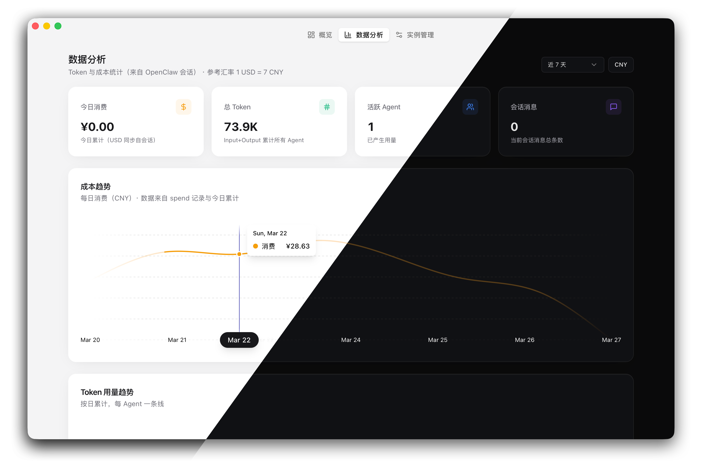
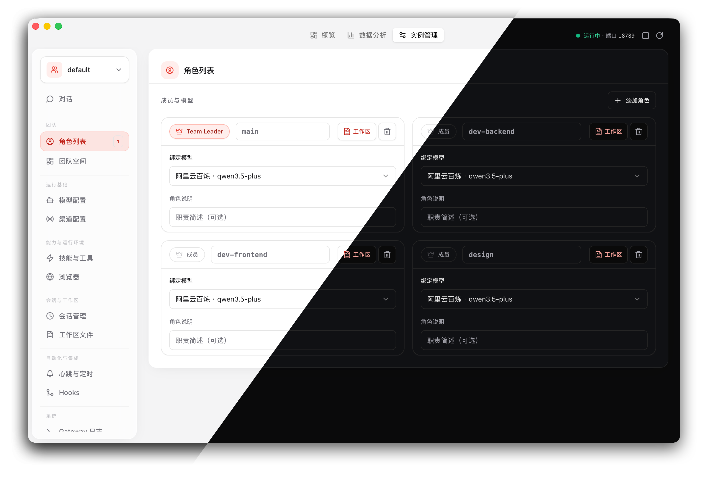
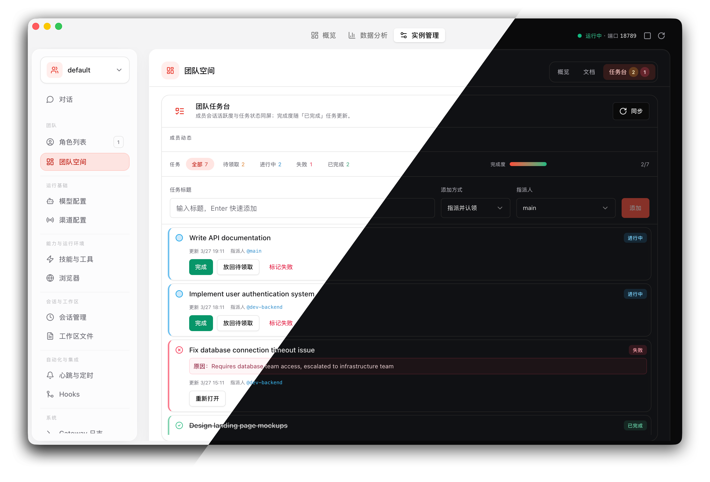
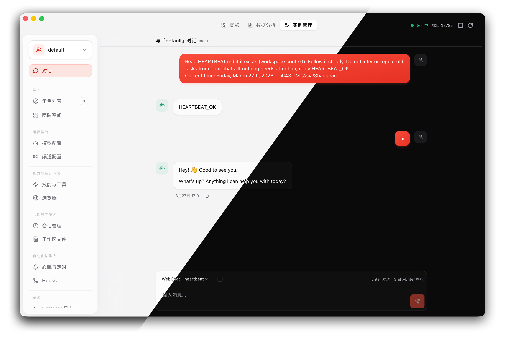

<div align="center">

# Pond

**OpenClaw 的桌面控制中心 — 一体化运维、团队协作与多实例编排**

[下载安装包](https://github.com/tageecc/pond/releases/latest) · [快速开始](#快速开始) · [功能特性](#功能特性) · [English](./README.md)

</div>

---

## 界面预览

### 数据分析面板

<div align="center">
  
  <p><em>实时监控 Token 消费、会话状态与系统资源</em></p>
</div>

### 角色管理

<div align="center">
  
  <p><em>多智能体角色管理，Team Leader 与成员配置</em></p>
</div>

### 团队任务管理

<div align="center">
  
  <p><em>任务状态机（待领取 → 进行中 → 完成/失败）与实时通知</em></p>
</div>

### 智能体对话界面

<div align="center">
  
  <p><em>流式对话、工具执行时间线与推理过程可视化</em></p>
</div>

---

## 核心特性

- 🚀 **一键启停 Gateway** — 按实例管理进程生命周期，实时监控端口、内存与日志
- 🤝 **团队协作层** — 角色管理、任务编排（open → claimed → done/failed）、实时通知与 Leader 统筹工作流
- 📊 **实时数据分析** — Token 用量、消费趋势、会话追踪与系统指标可视化
- 🔄 **多实例编排** — 单机多套 OpenClaw 环境（开发/测试/生产），独立运行、配置隔离
- ⚙️ **可视化配置** — 深度编辑 `openclaw.json`（模型、渠道、技能、Hooks），无需手写 JSON
- 💬 **WebSocket 实时对话** — 流式回复、工具调用时间线、按角色路由，与 Gateway 双向同步

---

## 快速开始

### 下载安装包

从 [GitHub Releases](https://github.com/tageecc/pond/releases/latest) 下载：

| 平台 | 文件 |
|------|------|
| **macOS (Apple Silicon)** | `Pond_<version>_aarch64.dmg` |
| **macOS (Intel)** | `Pond_<version>_x64.dmg` |
| **Windows** | `Pond_<version>_x64.msi` |
| **Linux** | `Pond_<version>_amd64.AppImage` |

> [!TIP]
> **macOS 用户**：首次打开未签名应用时，**Control-点按** 应用图标，选择 **打开** → **打开**。或在 **系统设置 → 隐私与安全性** 中允许。

### 本地开发

**前置条件**

- Node.js 20+
- [pnpm](https://pnpm.io)
- [Rust](https://rustup.rs/)（运行 `pnpm tauri:dev` 必需）

**启动开发环境**

```bash
git clone https://github.com/tageecc/pond.git
cd pond
pnpm install
pnpm tauri:dev
```

> [!NOTE]
> 若 `pnpm install` 失败，运行 `rm -rf node_modules/.cache && pnpm install`

**构建安装包**

```bash
pnpm build
pnpm tauri build
```

产物在 `src-tauri/target/release/bundle/`

---

## 功能特性

<details>
<summary><strong>🎯 团队协作</strong></summary>

<br/>

- **角色管理** — 从 `agents.list` 自动同步，定义 Leader（`main`）与执行角色职责
- **任务状态机** — `open`（待领取）→ `claimed`（进行中）→ `done`（完成）/ `failed`（失败，需填原因）
- **实时通知** — 任务变更通过 WebSocket 推送到相关角色会话
- **协作 Skill** — 内置 `pond-team` 技能，定义 Leader 统筹需求、拆解任务与执行方任务闭环的完整工作流
- **团队空间** — 元数据（`team/<instance>.json`）与任务（`team/<instance>_tasks.json`），与 OpenClaw 原生 `read`/`write` 工具无缝集成

</details>

<details>
<summary><strong>🔧 运维管理</strong></summary>

<br/>

- **进程管理** — 按实例启动/停止/重启 Gateway，监控端口、内存、CPU 与运行时长
- **日志聚合** — 实时查看与检索 Gateway 日志，stderr 错误高亮
- **诊断工具** — 健康检查、渠道探测、依赖检测（Rust、Node、OpenClaw 版本）
- **技能管理** — 安装/卸载/更新技能，打开技能目录，支持通过 Agent 路径安装

</details>

<details>
<summary><strong>📊 数据分析</strong></summary>

<br/>

- **实时指标** — Token 用量、消费、会话数、活跃智能体、系统资源（CPU/RAM）
- **历史追溯** — 从会话记录同步用量数据，按实例、角色、时间范围筛选
- **趋势可视化** — 时间序列图表、消费排行、异常检测
- **导出与报告** — 支持导出 CSV、生成消费报告

</details>

<details>
<summary><strong>⚙️ 配置编排</strong></summary>

<br/>

- **可视化编辑** — `openclaw.json` 所有字段（模型、渠道、技能、浏览器、会话、工作区、心跳、Hooks、日志）
- **实时校验** — 配置修改即时反馈，避免 JSON 语法错误
- **多实例同步** — API Key 池跨实例共享，配置模板快速复制
- **备份与恢复** — 配置历史版本管理

</details>

<details>
<summary><strong>🔄 多实例编排</strong></summary>

<br/>

- **环境隔离** — 单机多套 OpenClaw 目录（`~/.openclaw`、`~/.openclaw-dev`、`~/.openclaw-prod`）
- **独立运行** — 每个实例独立 Gateway 进程、端口、配置与团队数据
- **统一视图** — 跨实例监控、配置对比、资源统计
- **快速切换** — 实例间无缝切换，保持各自运行状态

</details>

<details>
<summary><strong>💬 实时对话</strong></summary>

<br/>

- **流式回复** — WebSocket 双向通信，打字机效果实时呈现
- **工具执行时间线** — 可视化工具调用链、执行耗时、参数与返回值
- **推理过程** — 显示模型内部思考（reasoning）
- **按角色路由** — 多智能体场景下，对话可指定角色（基于 `agents.list`）
- **会话管理** — 历史会话检索、导出、删除

</details>

---

## 工作原理

```
  ┌─────────────┐     ┌──────────────┐     ┌─────────────────┐
  │  React UI   │────▶│ Tauri (Rust) │────▶│ OpenClaw Gateway │
  │  Zustand    │     │ invoke / WS  │     │  ~/.openclaw*    │
  └─────────────┘     └──────────────┘     └─────────────────┘
```

1. **配置发现** — 扫描 OpenClaw 目录结构，加载 `openclaw.json` 与团队数据
2. **进程编排** — Rust 后端按实例管理 Gateway 子进程，端口自动分配
3. **状态同步** — WebSocket 实时双向通信，对话流、工具执行、任务变更
4. **并发安全** — 团队元数据与任务文件通过文件锁（`fs4`）保证多进程写入安全
5. **协议兼容** — 完全兼容 OpenClaw Gateway 协议与目录布局，不引入私有格式

---

## 技术栈

| 层级 | 技术 |
|-------|------|
| UI | React 19、TypeScript、TailwindCSS、Radix UI、Framer Motion、Visx |
| 桌面 Shell | Tauri 2、Rust |
| 状态管理 | Zustand |
| OpenClaw 集成 | `openclaw` npm 包 — [官方文档](https://docs.openclaw.ai) |

**关键技术实现**

- **进程管理** — `tokio::process` 异步子进程，生命周期独立管理
- **文件锁** — `fs4` 跨平台文件锁，保证团队数据并发安全
- **WebSocket** — Tauri 原生 WebSocket 插件，低延迟双向通信
- **配置校验** — JSON Schema 验证 + TypeScript 类型安全

Rust 命令：`src-tauri/src/commands/` · 注册：`lib.rs` · UI 组件：`src/components/`

---

## 数据存储

| 类型 | 位置 |
|------|--------|
| 应用偏好（主题、自启、托盘、视图） | Tauri [Store](https://v2.tauri.app/plugin/store/) — `src/lib/appStore.ts` |
| OpenClaw 配置 | 各实例目录（`openclaw.json`、`agents.list` 等） |
| 团队数据 | 实例根目录下 `team/<instance>.json` 与 `team/<instance>_tasks.json` |
| 应用数据（用量、聊天） | `app_data_dir`（macOS: `~/Library/Application Support/ai.clawhub.pond`） |

---

## Roadmap

**核心功能**

- [x] 多实例管理与切换
- [x] Gateway 进程生命周期管理（启动/停止/重启/监控）
- [x] 实时对话（WebSocket 流式回复、工具执行时间线、推理过程）
- [x] 团队协作层（角色管理、任务状态机 open/claimed/done/failed）
- [x] 实时任务通知（WebSocket 推送到相关角色会话）
- [x] 数据分析与可视化（Token 用量、消费趋势、会话追踪）
- [x] 可视化配置编辑（模型、渠道、技能、浏览器、Hooks、日志）
- [x] 内置 `pond-team` 协作 Skill（Leader 统筹与执行方闭环）
- [x] 跨平台支持（macOS Apple Silicon / Intel、Windows、Linux）
- [x] 技能管理（安装/卸载/打开目录）
- [x] 日志聚合与检索
- [x] 诊断工具（健康检查、渠道探测）

**开发中**

- [ ] 配置模板与快速导入（跨实例复制配置）
- [ ] 任务依赖关系可视化（DAG 图）
- [ ] 会话历史高级检索（全文搜索、按时间/角色筛选）
- [ ] 会话导出（Markdown / JSON / PDF）
- [ ] 技能市场（浏览、搜索、一键安装）

**规划中**

- [ ] 云端配置同步（跨设备同步 OpenClaw 配置）
- [ ] 多人协作模式（团队共享实例、权限管理）
- [ ] 自定义数据分析报告（按周/月生成消费报告）
- [ ] 配置版本管理（Git 集成、回滚）
- [ ] 插件系统（第三方扩展开发框架）
- [ ] API Key 池高级管理（负载均衡、健康检查）
- [ ] 移动端支持（iOS / Android 监控客户端）

---

## 贡献

欢迎 Issue 与 PR！

- 发起 PR 前请运行 `pnpm exec tsc --noEmit` 检查类型
- 详见 [CONTRIBUTING.md](./CONTRIBUTING.md) 与 [CODE_OF_CONDUCT.md](./CODE_OF_CONDUCT.md)

**安全披露** — [SECURITY.md](./SECURITY.md)

**维护者发布流程** — [RELEASING.md](./RELEASING.md)

---

## Star 历史

[](https://www.star-history.com/#tageecc/pond&Date)

---

## 许可证

[MIT](LICENSE)
